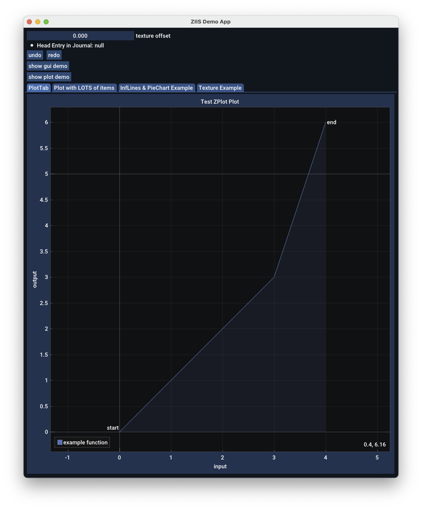

# ZGUI_CIMGUI_IMPLOT_SOKOL

## Overview

Bundles a set of tools for building user interfaces on desktop and WASM using
Zig, sokol, imgui and implot.

## Motivation

The zgui/zplot bindings from zig-gamedev:
[https://github.com/zig-gamedev/zig-gamedev](https://github.com/zig-gamedev/zig-gamedev)
are nicely ergonomic in zig, but the backend packaging in sokol is lighter
weight and more portable.  This combines bindings that are based on zgui/zplot
(with some additions) from zgui backed by sokol/dcimgui with a do-undo library,
a simple app framework, and a build system to make it easy to stand up small
applications built with imgui and implot in zig.

### Links:

* [https://github.com/zig-gamedev/zgui](https://github.com/zig-gamedev/zgui)
* [https://github.com/floooh/sokol-zig](https://github.com/floooh/sokol-zig)
* [https://github.com/floooh/dcimgui](https://github.com/floooh/dcimgui)
* [https://github.com/ocornut/imgui](https://github.com/ocornut/imgui)
* [https://github.com/epezent/implot](https://github.com/epezent/implot)

## Demo

* build and run the demo app: `zig build run` 
* builds the demo in wasm mode: `zig build run-demo -Dtarget=wasm32-emscripten` 

### Demo App



## Usage

To build on top of it:

```bash
zig fetch --save git+https://github.com/ssteinbach/zgui_cimgui_implot_sokol
```

Then, in your `build.zig`:

```zig
// build.zig

const ziis = @import("zgui_cimgui_implot_sokol");

// fn build()
    // non-wasm
    const dep_ziis = b.dependency(
        "zgui_cimgui_implot_sokol",
        .{
            .target = target,
            .optimize = optimize,
        }
    );

    app.root_module.addImport(
        "zgui_cimgui_implot_sokol",
        dep_ziis.module("zgui_cimgui_implot_sokol")
    );

    // wasm
    const dep_emsdk = ziis.fetchEmSdk(dep_ziis);

    // create a build step which invokes the Emscripten linker
    const link_step = try ziis.emLinkStep(
        b,
        .{
            .lib_main = demo,
            .target = target,
            .optimize = optimize,
            .emsdk = dep_emsdk,
            .use_webgl2 = true,
            .use_emmalloc = true,
            .use_filesystem = true,
            .shell_file_path = ziis.fetchShellPath(dep_ziis),
            .extra_args = &.{
                "-sUSE_OFFSET_CONVERTER",
            },
        }
    );

    // ...and a special run step to start the web build output via 'emrun'
    const run = ziis.emRunStep(
        b,
        .{ 
            .name = "demo",
            .emsdk = dep_emsdk 
        }
    );
    run.step.dependOn(&link_step.step);
    b.step("run", "Run demo").dependOn(&run.step);
```
